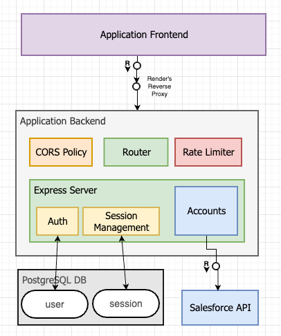

# Sales Accounts App

A demo application that integrates with Salesforce to fetch and display account details.

**Live Demo**: [https://sales-accounts-app-ui.onrender.com/](https://sales-accounts-app-ui.onrender.com/)

## Overview

The Sales Accounts App is a web application that allows users to view and browse account information from a Salesforce organization. It features user authentication, account listing with pagination, and detailed account views.

## Challenges

During the development of this project, several technical challenges were encountered:

- **Salesforce Integration**: Working with the jsforce library was challenging as I had no prior experience with it. The documentation was occasionally vague, requiring extensive research through documentation and forums. Some solutions were achieved through trial and error until the integration functioned correctly.

- **Vue.js Development**: Having primarily worked with React, adapting to Vue.js required learning a new framework. However, by thoroughly reading the documentation and applying these learnings, I was able to successfully develop the application without the framework becoming a barrier.

- **Deployment Configuration**: Setting up proper CORS policies and configuring session cookies to work correctly across the deployed application presented significant challenges. Through persistence and troubleshooting, these issues were eventually resolved.


## Architecture

The application follows a standard three-tier architecture:

- **Frontend**: Vue.js application
- **Backend**: Express.js REST API
- **Database**: PostgreSQL (hosted on neon.tech)

The project is structured as a monorepo with both frontend and backend code in the same GitHub repository, though they are deployed separately.



### Authentication System

The system provides the following endpoints:

| Endpoint | Method | Description | Request Body |
|----------|--------|-------------|-------------|
| `/api/v1/auth/register` | POST | Register a new user | `{ "email": string, "password": string }` |
| `/api/v1/auth/login` | POST | User login | `{ "email": string, "password": string }` |
| `/api/v1/auth/logout` | GET | User logout | - |
| `/api/v1/auth/validate-session` | GET | Validate current session | - |

#### Authentication Implementation

- **Password Security**: Passwords are hashed using bcrypt, which provides a secure way to hash and compare passwords along with salting.
- **Session Management**: User sessions are stored in PostgreSQL.
- **Authentication Flow**: Basic email/password authentication without third-party libraries. This decision was made to avoid unnecessary dependencies for a relatively simple authentication flow, providing better control over the implementation while keeping the codebase lighter.


### Salesforce Integration

The application connects to Salesforce using the jsforce library and OAuth 2.0 protocol. It provides the following API endpoints:

| Endpoint | Method | Description | Query Parameters |
|----------|--------|-------------|-----------------|
| `/api/v1/accounts` | GET | Retrieve accounts list | `limit`, `offset` |
| `/api/v1/accounts/count` | GET | Get total number of accounts | - |

- The `limit` and `offset` endpoints are provided to handle pagination from the frontend.
- The `count` endpoint helps calculate the total number of pages which would be required, without fetching all records.
 
### Frontend Features

- **Account Listing**: Displays all accounts' details with pagination.
- **Account Details**: Shows detailed information when clicking on an account, including shipping and billing addresses.
- **Pagination**: Dynamically calculates `limit` and `offset` based on page selection.


### Security Measures

The application implements several security features:

- **CORS Protection**: Restricts API access to only frontend's origin
- **Rate Limiting**: Prevents abuse through in-memory rate limiting
- **Input Validation**: Sanitizes and validates all user inputs
- **Secure Sessions**: httpOnly and secure session cookies

## Database Connectivity and Schema

The application uses the following tables:

### **Users Table** (`user`)
| Column | Type | Constraints |
|--------|------|-------------|
| `email` | VARCHAR (Primary Key) | Unique, Required |
| `password_hash` | TEXT | Required |

### **Session Table** (`session`)
| Column | Type | Constraints/Description |
|--------|------|-------------|
| `sid` | VARCHAR | Primary Key |
| `sess` | JSON | Session Data |
| `expires` | TIMESTAMP | Expiration Time |

## Development Setup

Follow these steps to set up the project locally:

1. Clone the repository:
   ```bash
   git clone git@github.com:chinsingh/sales-accounts-app.git
   ```

2. Create a `.env` file in the `backend` directory (use [.env.example](backend/.env.example) as a template)

3. Start the backend server:
   ```bash
   cd backend
   npm install
   npx tsx src/server.ts
   ```

4. Start the frontend application (in a separate terminal):
   ```bash
   cd frontend
   npm install
   npm run dev
   ```

### Local Development Configuration

When running locally, you'll need to make the following adjustments:

1. Update the session cookie configuration in `backend/src/server.ts`:
   ```typescript
   app.use(
     session({
       // ...
       cookie: {
         // ...
         secure: false, // Change to false for local HTTP development
         // ...
       },
       // ...
     })
   );
   ```

2. Update the backend URL in `frontend/src/constants.ts` to point to your local backend server:
   ```typescript
   export const BACKEND_BASE_URL = 'http://localhost:3000'; // Replace with your local backend URL
   ```

## Deployment

The application is deployed on Render, but can be deployed to any platform that supports Node.js applications.

### Backend Deployment

- **Root Directory**: `backend`
- **Build Command**: `npm install && npm run build`
- **Start Command**: `node dist/server.js`
- **Environment Variables**: Configure all required environment variables from `.env.example`

### Frontend Deployment

- **Update the backend URL**: Modify BACKEND_BASE_URL in constants.ts to point to the deployed backend.
- **Root Directory**: `frontend`
- **Build Command**: `npm install && npm run build`
- **Publish Directory**: `dist`
- **Configure routing**: Ensure `/*` rewrites to `/index.html` using your platforms rewrite configuration for proper routing.

## Technology Stack

- **Frontend**: Vue.js
- **Backend**: Express.js, Node.js
- **Database**: PostgreSQL
- **Authentication**: Custom implementation with bcrypt
- **Integration**: Salesforce jsforce library
- **Deployment**: Render (frontend and backend)

## Future Improvements

Scope of functionalities which can be considered in order to scale:

- Dynamic Salesforce org configuration
- Rate limiting on API Gateway with external store
- Comprehensive error handling and logging
- User role management
- Expanded account management features